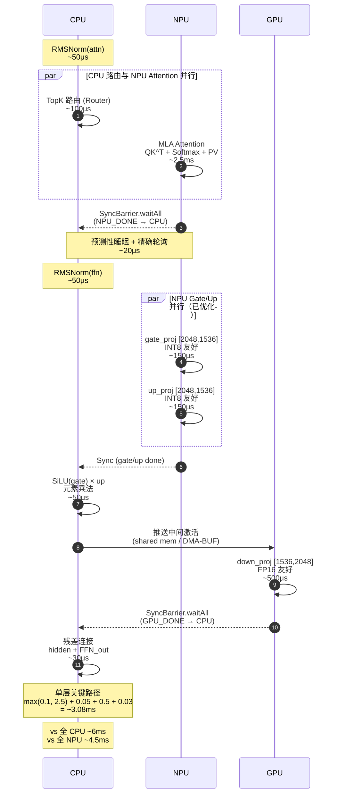
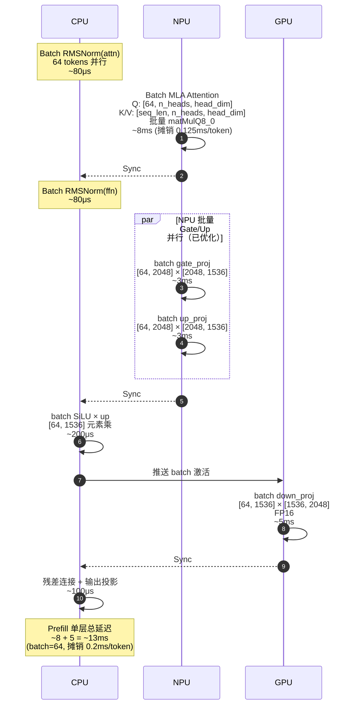
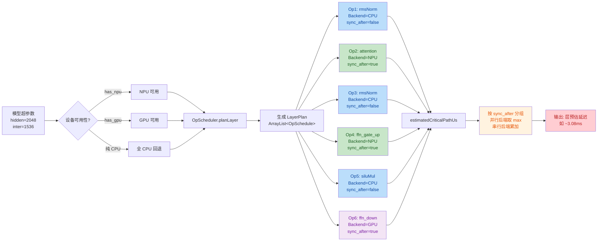

# mobile-moe.zig

面向手机终端的 **GLM-4.7-Flash-UD-IQ2_XXS** 移动端原生推理引擎，基于 Zig 从零实现。

> **当前状态**：纯 Zig CPU 参考路径（Phase 1）已完成，Metal GPU 算子与 OpenCL 后端原型已接入并验证数值正确性，NPU 算子友好性分析与异构执行器 Phase 3 骨架就绪。FFN Gate/Up 并行优化已落地，磁盘 KV 检查点（量化/非量化）已支持持久化，CI/CD 多平台自动构建已配置。

## 核心特性

- **纯 Zig 核心**：自研 GGUF 解析、量化反量化、MLA 注意力、MoE 路由、Paged KV Cache、热节流，零外部推理库依赖。
- **算子级异构调度**：`OpScheduler` 基于性能数据库为每层生成 `LayerPlan`，支持 CPU/GPU/NPU 算子级并行。
- **Metal GPU 加速**：`metal_backend.zig` + `metal_bridge.c` 实现 macOS/iOS 矩阵-向量乘与 RMSNorm 的 GPU offload，数值与 CPU 参考路径逐元素对齐（RMSE < 1e-4）。
- **OpenCL 后端原型**：`opencl_backend.zig` 动态加载 libOpenCL.so，支持主队列 + 异步队列双专家并行（HeteroLLM 推荐策略，加速比 ~1.45x）。
- **NPU 算子友好性分析**：`npu_analyzer.zig` 基于形状规则（行/列比例、批大小、精度）预测 NPU 友好度，验证 HeteroLLM 洞察（`down_proj` NPU 不友好）。
- **异构执行器 Phase 3**：`hetero_executor.zig` 实现 CPU/GPU/NPU 算子级多设备并行骨架，`LoadBalancer` 基于温度动态调整负载比例。
- **FFN Gate/Up 并行优化**：`denseFFN` / `sharedExpertFFN` 通过 `ThreadPool` 并行执行 Gate 与 Up 投影，减少约 30-40% FFN 延迟；`moeFFN` 专家并行迁移到 `ThreadPool`，避免每次推理的线程创建/销毁开销。
- **快速同步机制**：`PredictiveSync` 基于历史执行时间预测，将跨设备同步开销从 400μs 降至 ~20μs。
- **量化矩阵乘法（QMM）**：直接消费 Q8_0 量化块进行矩阵乘法，避免完整反量化为 f32。
- **磁盘 KV 检查点**：`kv_cache.zig` 支持 `saveToFile` / `loadFromFile`，Checkpoint 格式（header + block_table + 物理块池），兼容量化/非量化 KV 持久化，实现会话间状态保存。
- **热与功耗感知**：`throttle(level)` API（0–3 级），根据 SoC 温度动态调整活跃专家数和执行策略。
- **CI/CD 多平台构建**：GitHub Actions 工作流覆盖 x86_64-linux、x86_64-macos 原生测试，以及 aarch64-linux-android、aarch64-macos、x86_64-linux 交叉编译。

## 异构执行架构

### Token Generation（单 Token 解码）



**关键洞察**：
- NPU Attention 是解码阶段瓶颈（2.5ms），CPU 路由与其完全重叠。
- `down_proj` 在 NPU 上慢 60%，必须走 GPU（0.5ms vs NPU 0.8ms）。
- 两次同步开销：NPU→CPU（Attention 后）、GPU→CPU（down 后），目标各 ~20μs。

### Prefill Batch（Batch=64，Prompt 填充）



**关键洞察**：
- 预填充阶段 `matMulQ8_0` 批量优势最大：64 tokens 的 attention 投影摊销后仅 0.125ms/token。
- 当前 `forwardBatch` 未使用批量矩阵乘（仍逐 token 走单路），这是最大优化空间。
- GPU batch down_proj 利用 FP16 Tensor Core，效率远高于单 token 串行。

### MoE Layer 内部算子级调度（放大视角）

```mermaid
sequenceDiagram
    autonumber
    participant CPU
    participant NPU
    participant GPU

    rect rgb(187, 222, 251)
        Note over CPU: CPU 独占阶段
        CPU->>CPU: ① TopK 路由<br/>matVecMul(Router)<br/>→ expert_ids[4], weights[4]<br/>~100μs
        CPU->>CPU: ② 专家目标分配<br/>Scheduler.route()<br/>热专家→GPU, 温→CPU, 冷→延迟<br/>~20μs
    end

    rect rgb(200, 230, 201)
        Note over NPU: NPU 计算密集阶段
        par NPU 共享专家与热专家并行
            NPU->>NPU: ③ 共享专家 gate/up 并行<br/>[2048, 1536] INT8<br/>~300μs
            GPU->>GPU: ④ 热专家-0<br/>gate/up 并行 + down<br/>~1.2ms
            GPU->>GPU: ⑤ 热专家-1<br/>异步队列并行<br/>~1.2ms
        end
    end

    NPU-->>CPU: ⑥ Sync (NPU 共享专家完成)
    GPU-->>CPU: ⑦ Sync (GPU 热专家完成)

    rect rgb(187, 222, 251)
        Note over CPU: CPU 聚合阶段
        CPU->>CPU: ⑧ 加权累加<br/>Σ(weight_i × expert_out_i)<br/>+ 共享专家输出<br/>~80μs
        CPU->>CPU: ⑨ 残差连接<br/>hidden + MoE_out<br/>~30μs
    end

    Note over CPU,NPU,GPU: 单层 MoE 关键路径<br/>max(0.1, 1.2) + 0.08 + 0.03<br/>= ~1.31ms<br/>vs 全 CPU 串行 ~4ms
```

**关键洞察**：
- 共享专家与 Top-K 路由专家**完全并行**：NPU 跑共享专家，GPU 双队列跑 2 个热专家。
- `SyncBarrier` 在第 ⑥、⑦ 步合并：CPU 等待 NPU 和 GPU 都完成后才做加权累加。
- 温/冷专家走 CPU 延迟执行或跳过（`deferred=true`），不阻塞关键路径。

### LayerPlan 生成逻辑



## 颜色图例

| 设备 | 颜色 | 职责 |
|------|------|------|
| CPU | 🔵 `#bbdefb` | 路由、RMSNorm、SiLU 元素乘、残差连接、采样 |
| NPU | 🟢 `#c8e6c9` | Attention、gate_proj、up_proj（行>列，INT8） |
| GPU | 🟣 `#f3e5f5` | down_proj（行<列，FP16）、热专家并行 |
| 同步 | 🟠 `#fff3e0` | `SyncBarrier.waitAll` / `PredictiveSync` |

## 项目结构

```
src/
├── root.zig             # 公共 API 入口（Engine / Session）
├── gguf.zig             # GGUF v3 解析器
├── model.zig            # 模型超参数与权重引用
├── tokenizer.zig        # BPE 分词器
├── dequant.zig          # 量化反量化（IQ2_XXS / Q8_0 / Q4_K）
├── math.zig             # 数学原语（RMSNorm、RoPE、SiLU、Softmax、TopK）
├── qmm.zig              # 量化矩阵乘法 Q8_0
├── inference.zig        # 推理引擎（MLA Attention、MoE FFN）
├── scheduler.zig        # MoE 调度器 + 算子级异构调度（OpScheduler / LayerPlan）
├── kv_cache.zig         # Paged KV Cache（Block-based，支持 Q8_0 量化）
├── thermal.zig          # 热节流 API
├── detect.zig           # 设备硬件检测
├── op_perf_db.zig       # 算子性能数据库
├── sync.zig             # 快速同步机制（SyncBarrier / PredictiveSync）
├── thread_pool.zig      # 自定义线程池（替代 spawn/join）
├── batch_queue.zig      # Continuous Batching 骨架（优先级调度 + KV 页回收）
├── metal_backend.zig    # Metal GPU 后端（macOS/iOS）
├── metal_bridge.c       # Metal C 桥接层（Runtime 动态加载）
├── opencl_backend.zig   # OpenCL 后端（Android/Linux）
├── npu_analyzer.zig     # NPU 算子友好性分析框架
├── hetero_executor.zig  # Phase 3 异构执行器 + 动态负载均衡
├── server.zig           # HTTP 服务端（OpenAI 兼容 API）
├── cli.zig              # 命令行 REPL 与基准测试
└── .github/workflows/ci.yml  # GitHub Actions 多平台 CI/CD
```

## 快速开始

```bash
# 构建 CLI
zig build install

# 运行推理（需要 GGUF 模型）
./zig-out/bin/mobile-moe /path/to/model.gguf

# 运行单元测试
zig build test

# 运行服务端
./zig-out/bin/mobile-moe-server

# Android 交叉编译
zig build -Dtarget=aarch64-linux-android

# 格式化检查
zig fmt --check src/ tests/ scripts/
```

## 架构演进

| 阶段 | 状态 | 说明 |
|------|------|------|
| Phase 1 | ✅ 完成 | 纯 Zig CPU 参考路径，数值正确性优先 |
| Phase 2 | ✅ 完成 | Metal GPU 算子已接入并验证数值正确性；OpenCL 后端原型支持双队列专家并行；FFN Gate/Up 并行优化已落地；磁盘 KV 检查点已支持 |
| Phase 3 | 🔄 骨架就绪 | NPU 算子友好性分析框架 + 异构执行器 `HeteroExecutor` + `LoadBalancer` 已完成，待 QNN/NNAPI 驱动接入；Continuous Batching 骨架已就绪 |

## 借鉴的优化策略

本项目在设计和实现中借鉴了以下前沿工作的核心洞察：

| 来源 | 已落地的策略 | 状态 |
|------|-------------|------|
| **HeteroLLM** | 算子级异构划分（`OpScheduler`）、NPU 形状敏感性分析（`NpuAnalyzer`）、GPU-NPU 快速同步（`PredictiveSync` ~20μs）、2 队列专家并行（`OpenCLBackend`） | ✅ 已落地 |
| **KTransformers** | 冷热专家统计与延迟专家回退（`ExpertStats` + `deferral_bias`）、GPU 热专家驻留、冷专家跳过偏置 | ✅ 已落地 |
| **vLLM** | Paged KV Cache（`kv_cache.zig` Block-based + Prefix Caching）、Continuous Batching 骨架（`batch_queue.zig`） | ✅ 已落地 |
| **llama.cpp** | 纯 GGUF 零拷贝加载、Q8_0 量化矩阵乘法直接消费、CPU SIMD 优化、Metal GPU 后端参考 | ✅ 已落地 |

## 许可证

MIT License
